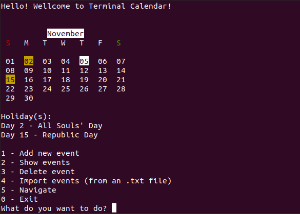

# Terminal Calendar
A calendar for terminals made with Python.



## How to Install?
You only have to install the packages on ```requirements.txt```. So you will need:

```
- Python 3
- Xclip
- Python dateutil
```

Also, is important to know that the file ```pyxhook.py``` is a library, but you do not need to install it.

## How to use?
After installing all the required packages, all you have to do is run the following command:

```
python main.py
```

Just it! Your Terminal Calendar is ready to be used.

## Tip
If you want (and use linux), you can create a Makefile, like this:

```
all:
    python main.py
```

So, the only thing you have to do is type ```make``` on terminal.

## Help and Suggestions
If you have some problem with the code or have any suggestion, be free to enter in touch with me on e-mail: andrearagao1003@outlook.com.
